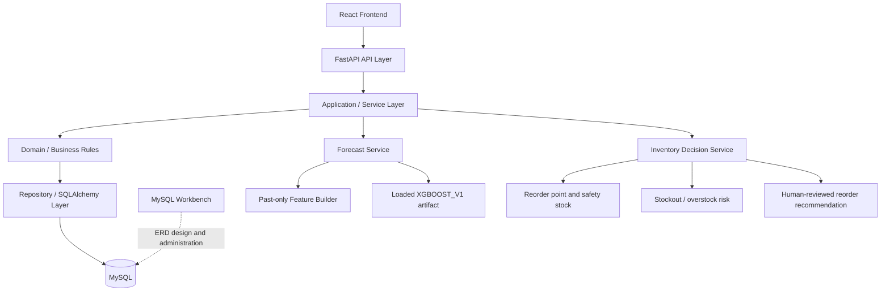

# Architecture

## High-level Architecture

```text
React + Vite Frontend
      ↓
FastAPI Backend
      ↓
SQLAlchemy
      ↓
MySQL
      ↑
MySQL Workbench (ERD design and database administration)
```

## Business Pipeline

```text
Sales History
      ↓
Preprocessing
      ↓
Time-Series Feature Engineering
      ↓
Forecast Model
      ↓
Predicted Demand
      ↓
Current Inventory + Supplier Lead Time + Safety Stock + Incoming Stock
      ↓
Stockout / Overstock Analysis
      ↓
Reorder Recommendation
```

## Scope Boundaries

This is a single-store MVP for a small/medium supermarket, not a full ERP. Planned forecasting must influence actual inventory recommendations; it is not an isolated analytics feature. Full POS, payment, accounting, loyalty, delivery logistics, native mobile, full multi-branch support, barcode scanning, and advanced deep learning remain out of scope unless explicitly approved.

## Database Technology Decision

**MySQL** is the planned relational database engine. **MySQL Workbench is not the database**: it is the GUI/tool for ERD design, schema inspection, SQL execution, and database administration during development. FastAPI will access MySQL through SQLAlchemy. Migrations and the final database are not implemented yet.

## Sales Data Ingestion Architecture

### Initial Historical Import

```text
Existing supermarket POS historical export
      ↓
CSV import process
      ↓
Smart Inventory Market
      ↓
sales_daily
```

An initial CSV import gives a newly adopting supermarket enough history for forecasting.

### Ongoing Sales Sync

```text
POS / external sales system
      ↓
API or database integration
      ↓
Smart Inventory Market
      ↓
sales_daily
```

The thesis MVP needs CSV sales import and a clearly defined future POS/API integration boundary; it does not need to implement a complete POS. In model development/evaluation, M5 supplies historical sales. In a real deployment, the system must eventually use that supermarket's own POS sales, not Walmart M5 data.

## Layered Backend Design — CHECKPOINT-011



P13+ must preserve these boundaries: FastAPI routes coordinate requests and responses but must not contain all business rules. Forecasting and inventory decision logic are separate services, while repositories isolate persistence concerns. The system is decision support: recommendation generation ends in human manager review and must not automatically purchase from suppliers.

## Current Implementation Status

Only a FastAPI smoke application and React/Vite environment scaffold exist. CHECKPOINT-011 freezes the future inventory simulation and business-process design, but database, forecasting service, decision engine, routes, and business integrations are still unimplemented.
