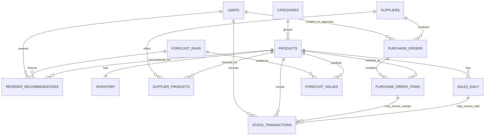

# Database Schema

Status: **FROZEN AND IMPLEMENTED — CHECKPOINT-013**

The single-store MVP uses MySQL 8.x. SQLAlchemy models in `backend/app/db/models/application.py` and Alembic revision `f86d36b27719` are the sole schema source of truth. MySQL Workbench visualizes and administers that schema; it is not the database engine and must not become a second hand-maintained schema.

For a plain MySQL DDL view of all 14 application tables, see [`schema_reference_mysql.sql`](schema_reference_mysql.sql). It is a readability/reference file only; SQLAlchemy models + Alembic remain the schema source of truth.

## Runtime and Migration Foundation

- **Database:** local MySQL Server database `smart_inventory_market`, configured for `utf8mb4` / `utf8mb4_0900_ai_ci`.
- **Access path:** FastAPI → SQLAlchemy 2.x → PyMySQL → MySQL Server.
- **Migration:** Alembic revision `f86d36b27719` (`create initial application schema`). `alembic.ini` contains no database URL; `alembic/env.py` reads `DATABASE_URL` through application settings.
- **Configuration:** a local ignored `.env` provides `DATABASE_URL` in `mysql+pymysql://...` form. The tracked `.env.example` contains placeholders only.
- **Time convention:** application-generated `created_at`, `updated_at`, `occurred_at`, `generated_at`, and review/receipt timestamps are UTC values. MySQL `DATETIME` does not retain a timezone offset, so the application writes UTC consistently.
- **Deletion policy:** foreign keys use MySQL's restrictive default. Historical operational records are not cascade-deleted. Users, products, and suppliers use `is_active` rather than routine deletion.

## ER Diagram

There is deliberately no `stores` or warehouse table: this thesis MVP is single-store.

## Implemented Tables

| Table | Purpose | Important columns and relationships |
| --- | --- | --- |
| `users` | Future manager/admin/inventory-staff identities. | Unique indexed `email`, `password_hash` only (never plaintext), `full_name`, controlled `role`, `is_active`; references from orders, transactions, and reviews. |
| `categories` | Product grouping. | Unique `code`, `name`, optional `description`; one category has many products. |
| `products` | Sellable inventory products. | Unique indexed `sku`, `name`, `category_id`, `unit`, `is_active`; one inventory row at most and links to sales, suppliers, orders, forecasts, transactions, recommendations. |
| `suppliers` | Vendor master data. | Unique `code`, contact fields, `is_active`; links to supplier-product options and purchase orders. |
| `supplier_products` | Supplier/product many-to-many data. | Unique `(supplier_id, product_id)`, optional decimal `unit_cost`, required positive `lead_time_days`, preferred flag. |
| `inventory` | Current single-store on-hand state. | `product_id` is both PK and FK; nonnegative integer `on_hand`, `updated_at`. It intentionally does not persist a freely editable `on_order` value. |
| `sales_daily` | Normalized application sales history / future CSV-POS import target. | Unique `(product_id, sale_date)`, nonnegative `quantity_sold`, nullable nonnegative retail `sell_price`, optional `source`; one product/date/quantity per row, never M5 day columns. |
| `purchase_orders` | Supplier purchase-order header. | Unique indexed `po_number`, supplier and optional creator/approver FKs, controlled lifecycle `status`, order/arrival/receipt dates, notes. |
| `purchase_order_items` | Purchase-order lines. | Unique `(purchase_order_id, product_id)`, positive ordered quantity, received quantity between zero and ordered quantity, optional decimal `unit_cost`. |
| `stock_transactions` | Immutable future audit trail for stock movements. | Product, controlled type, positive quantity, UTC occurrence time, optional PO-item/sales/user provenance, reason. P13 creates persistence only; later services must forbid editing history. |
| `forecast_runs` | Forecast-run metadata. | Model/feature identifiers, history/forecast dates, positive horizon, UTC generation time. The external model file is not stored in MySQL. |
| `forecast_values` | Per-product demand forecasts. | Unique `(forecast_run_id, product_id, forecast_date)`, positive horizon day, nonnegative `DECIMAL(14,4)` predicted demand. |
| `model_metrics` | Compact evaluation metadata. | Model/feature/split identifiers and nullable `DECIMAL(14,6)` MAE, RMSE, WAPE; no bulk report CSV import. |
| `reorder_recommendations` | Human-reviewed inventory-decision snapshots. | Product/optional forecast run, controlled status, captured on-hand/incoming/lead-time/safety-stock/reorder values, optional approved quantity and reviewer. |

## Controlled Status Values

SQLAlchemy portable enums (`native_enum=False` with check constraints) represent controlled statuses without MySQL-native `ENUM` lock-in:

| Domain | Values |
| --- | --- |
| User role | `ADMIN`, `MANAGER`, `INVENTORY_STAFF` |
| Purchase order | `DRAFT`, `APPROVED`, `ORDERED`, `IN_TRANSIT`, `RECEIVED`, `CANCELLED` |
| Stock transaction | `RECEIPT`, `SALE`, `ADJUSTMENT_IN`, `ADJUSTMENT_OUT` |
| Recommendation | `NEW`, `ACCEPTED`, `MODIFIED`, `REJECTED`, `EXPIRED` |

## Important Constraints and Indexes

- Monetary fields (`unit_cost`) and continuous forecasts (`predicted_demand`) use `DECIMAL`/`NUMERIC`, never floating-point currency.
- `inventory.on_hand`, sales quantity, incoming/recommendation quantities, forecast demand, and other quantity-like fields have nonnegative checks; ordered quantity, stock transaction quantity, horizon, and lead time are positive where required.
- A purchase-order line cannot receive more than it ordered; supplier-product and purchase-order-item pairs are unique.
- Unique business identifiers: user email, category code, product SKU, supplier code, and purchase-order number.
- Query indexes include product category/SKU, PO status/number, stock transaction `(product_id, occurred_at)`, forecast `(product_id, forecast_date)` and run, recommendation `(product_id, created_at)` and status. Composite uniqueness on daily sales also serves normal product/date history lookup.
- P13 does not enforce workflow transitions. P14/P16 must enforce: no negative on-hand inventory in normal transactions, auditable stock movement, receipt-only inventory increase, sale/fulfillment decrease, manager review for recommendations, and no automatic supplier purchase.

## Incoming Stock and Audit Invariants

Incoming/on-order inventory is derived later from `purchase_order_items.ordered_quantity - received_quantity` for eligible open purchase-order statuses. It is intentionally not duplicated in `inventory`, avoiding conflicting editable state. `CANCELLED` orders and completed `RECEIVED` orders do not contribute to incoming quantity.

Accepting or modifying a recommendation does not change `inventory.on_hand`; creating a purchase order does not either. A later receipt service must both record a `RECEIPT` stock transaction and increase inventory atomically. Sales/fulfilled stock-outs must record the appropriate transaction and decrease inventory. P13 establishes the schema required for those rules but does not implement the services.

## Verification Evidence

On 2026-10-01, local MySQL 8.0.46 applied migration `f86d36b27719`; Alembic `current` and `heads` both reported that revision, and `alembic check` found no schema drift. SQLAlchemy inspection found 14 application tables, 19 foreign keys, 26 indexes, and 23 check constraints. A temporary category/product transaction flushed, queried, and rolled back; the product was confirmed absent afterwards. See [database setup](database_setup.md) for reproducible local commands and Workbench ERD instructions.

## P14 Operational Use Without Schema Change

P14 uses the frozen schema unchanged; Alembic remains at `f86d36b27719`. Product creation creates the one required `inventory` row with `on_hand = 0` in the same transaction. `inventory.on_hand` is not exposed as a generic writable resource: manual adjustments and purchase-order receipts atomically update it and create immutable `stock_transactions` records.

For the P14 inventory read model, incoming quantity is derived at query time as `ordered_quantity - received_quantity` only from purchase orders in `ORDERED` or `IN_TRANSIT`. `DRAFT`, `APPROVED`, `RECEIVED`, and `CANCELLED` orders do not count. Full receipt moves an order from `IN_TRANSIT` to `RECEIVED`, records receipt transactions, and therefore reduces its derived incoming quantity to zero.

## P15 Sales Price Migration and Forecast Persistence

Alembic revision `8ac7d44590e3` adds nullable `sales_daily.sell_price DECIMAL(12,2)` and `sell_price IS NULL OR sell_price >= 0`. It is a retail selling price for the frozen feature set, never a supplier `unit_cost`. Historical imports may leave it null because FEATURE_SET_V1 explicitly models missing price history. Forecast APIs persist a run and all daily values atomically; they do not alter inventory, purchase orders, stock transactions, or recommendations.
