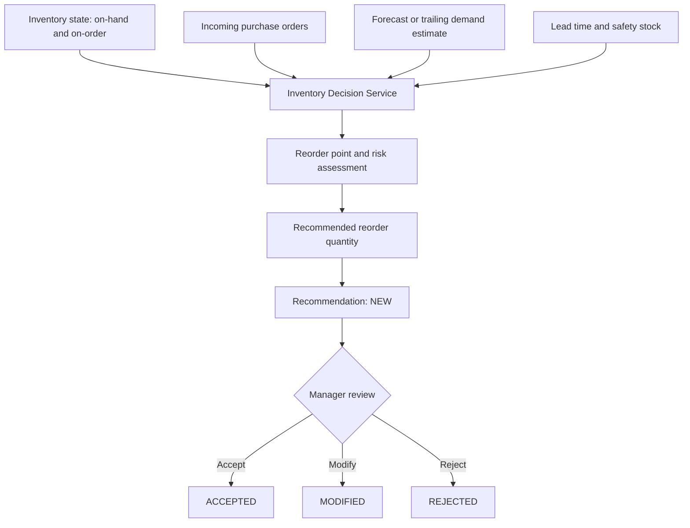
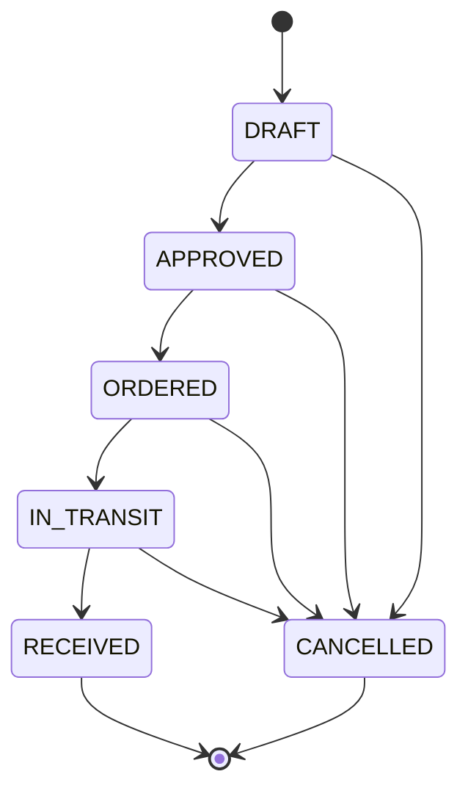

# Business Processes

Status: **DONE — CHECKPOINT-011.** These are frozen business requirements for later database and application work, not implemented workflows.

## Decision-Support Boundary

Smart Inventory Market recommends replenishment for a human manager. It does not automatically send supplier purchases. A recommendation is advisory until a manager accepts, modifies, or rejects it.

## A. Sales Ingestion

```text
POS export or CSV import
        -> validation and duplicate/error checks
        -> sales_daily
        -> inventory consumption and reporting
        -> forecasting history
```

The thesis MVP begins with historical CSV import. A later deployment may connect a POS/API integration, but M5 remains an offline model-development dataset rather than a production POS feed.

## B. Forecast Workflow

```text
sales_daily
        -> past-only feature generation
        -> loaded XGBOOST_V1 artifact
        -> recursive 28-day forecast
        -> 7 / 14 / 28-day demand summaries
        -> forecast-run and forecast-value storage
```

Only information available when a forecast is issued may enter its features. `XGBOOST_V1` with the 25-feature `FEATURE_SET_V1` was selected before, and evaluated once during, the frozen P12 final TEST step. That TEST result is final evidence only and cannot be reused for model selection or tuning.

## C. Reorder Recommendation



The decision service uses inventory position (`on_hand + on_order`) and must keep recommendation calculation separate from API route handling.

## D. Human Approval

Recommendation statuses are conceptually frozen as:

```text
NEW -> ACCEPTED
NEW -> MODIFIED
NEW -> REJECTED
NEW -> EXPIRED
```

Acceptance may create or support a purchase-order draft/workflow, but it does not itself increase on-hand stock.

## E. Purchase-Order Lifecycle



Frozen conceptual statuses: `DRAFT`, `APPROVED`, `ORDERED`, `IN_TRANSIT`, `RECEIVED`, and `CANCELLED`. P13 will decide their database representation; P11 does not create database enums.

## F. Goods Receipt

```text
purchase order received
        -> purchase-order line received quantity recorded
        -> immutable RECEIPT stock transaction
        -> on-hand inventory increases
        -> incoming / on-order quantity decreases
```

Only an actual receipt increases on-hand inventory. Open purchase-order quantities contribute to incoming/on-order; cancelled quantities do not.

## G. Sale and Stock-out Recording

```text
sale imported or recorded
        -> sales_daily updated
        -> immutable SALE stock transaction
        -> on-hand inventory decreases, never below zero
        -> unavailable units may be recorded as stock-out / lost-sale information when known
```

M5 does not reveal real stock-outs or lost demand. Its sales are therefore a demand proxy for the planned simulation, not a complete operational stock-out feed.

## H. Manual Adjustment

```text
inventory discrepancy
        -> authorized adjustment with reason
        -> immutable ADJUSTMENT_IN or ADJUSTMENT_OUT transaction
        -> audit trail and recalculated current inventory
```

Frozen stock-transaction types are `RECEIPT`, `SALE`, `ADJUSTMENT_IN`, and `ADJUSTMENT_OUT`.

## State and Audit Rules

- Stock changes require auditable transactions; current inventory is a controlled state, not an untracked editable number.
- Normal transaction processing must not result in negative on-hand inventory.
- Reorder recommendations require human review; no automatic supplier purchase is in scope.
- Purchase-order receipt, not recommendation acceptance or order placement, changes on-hand inventory.

## P14 Implementation Boundary

P14 implements category/product/supplier maintenance, supplier-product eligibility, auditable adjustments, purchase-order creation/line maintenance, a restricted PO state machine, and receipt processing. The state machine is `DRAFT → APPROVED → ORDERED → IN_TRANSIT → RECEIVED`, with cancellation allowed from every nonterminal pre-receipt state. `RECEIVED` can be reached only by complete goods receipt, never by a generic status change.

Creating, approving, ordering, or sending a PO in transit never changes on-hand inventory. Only adjustment and receipt services change it, each with an immutable stock transaction. P14 intentionally leaves sales ingestion, forecasting, reorder recommendation calculation, authentication, and automatic supplier purchasing outside scope.
